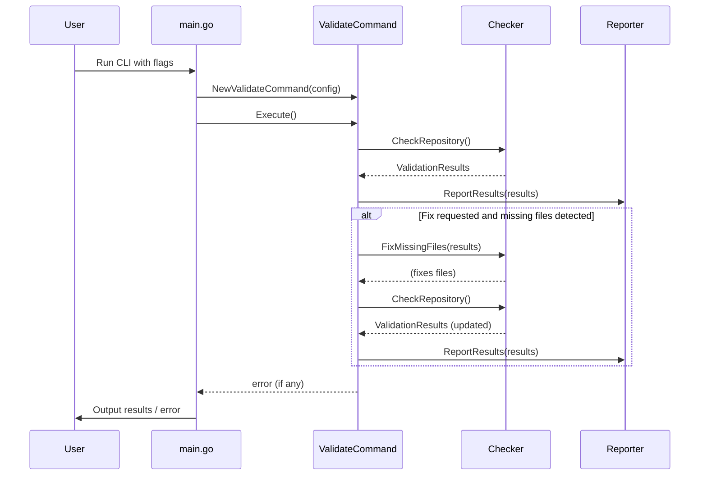

# Description

A script for validating the presence of common project files in a repository. 
It can be used to ensure that all required files are present and to generate missing files if desired.

## Architecture

