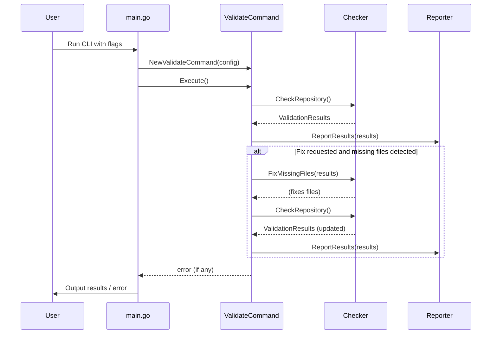

# Repository Validation Script

A tool for validating the presence of common project files in a repository. It ensures that repositories follow best practices by checking for essential files and can automatically generate missing files.

## Overview

This validation script helps maintain consistency across repositories by:

- Checking for the presence of essential files (README.md, LICENSE.md, etc.)
- Validating project-specific files based on the technology stack
- Generating missing files from templates when possible
- Providing clear, actionable feedback about missing files

The tool is configurable to work with different types of repositories and can be integrated into CI/CD pipelines or used as a pre-commit hook.

## Installation

### From Source

```bash
# Clone the repository
git clone https://github.com/LarsArtmann/templates.git
cd templates/repo-validation

# Build the tool
go build -o repo-validate

# Optional: Install to your PATH
sudo mv repo-validate /usr/local/bin/
```

### Using Go Install

```bash
go install github.com/LarsArtmann/templates/repo-validation@latest
```

## Usage

```bash
# Basic validation (current directory)
repo-validate

# Validate a specific repository
repo-validate --path /path/to/repository

# Generate missing files
repo-validate --fix

# Only report issues without making changes
repo-validate --dry-run

# Output results in JSON format
repo-validate --json

# Show help
repo-validate --help

# Run in interactive mode
repo-validate --interactive

# Show version information
repo-validate --version
```

### Options

**Basic Options:**
- `--path`: Path to the repository to validate (default: current directory)
- `--fix`: Generate missing files based on templates
- `--dry-run`: Only report issues without making changes
- `--json`: Output results in JSON format
- `--interactive`: Prompt for missing parameters instead of failing
- `--version`: Show version information and exit

**File Group Options:**
- `--all`: Check all optional file groups
- `--augment`: Check Augment AI related files (.augment-guidelines, .augmentignore)
- `--docker`: Check Docker related files (Dockerfile, docker-compose.yaml, .dockerignore)
- `--typescript`: Check TypeScript/JavaScript related files (package.json, tsconfig.json)
- `--devcontainer`: Check DevContainer related files (.devcontainer.json)
- `--devenv`: Check DevEnv related files (devenv.nix)

## Default Behavior

**By default, only the core files are checked:**
- README.md
- LICENSE.md
- .gitignore
- SECURITY.md

Use the file group options described above to check additional files.

### Interactive Mode

When running with the `--interactive` flag, the tool will prompt for missing parameters instead of failing. This is useful when:

- You're not sure which file groups to check
- You've specified incompatible options (like `--dry-run` and `--fix` together)
- You want to be guided through the validation process

The interactive mode provides a simple command-line interface for selecting options:

**Example Usage:**

```bash
# Check a TypeScript project with Docker support
./repo-validate --typescript --docker

# Check all possible files in a repository
./repo-validate --all

# Generate missing files for a TypeScript project
./repo-validate --typescript --fix
```

### Exit Codes

- `0`: Success - all must-have files are present
- `1`: Error - some must-have files are missing or an error occurred

### Example Output

```
INFO Repository Validation Results
INFO ===========================
ERROR ✗ Some must-have files are missing status=failed
ERROR Missing must-have files:
ERROR   - README.md
ERROR   - .gitignore
ERROR   - LICENSE.md
ERROR   - SECURITY.md
WARN Missing should-have files:
WARN   - AUTHORS
WARN   - MAINTAINERS.md
WARN   - .editorconfig
WARN   - .augment-guidelines
WARN   - .augmentignore
WARN   - CONTRIBUTING.md
WARN   - CODE-OF-CONDUCT.md
WARN   - CODEOWNERS
INFO Run with --fix to generate missing files
```

#### JSON Output Example

```json
{
  "success": false,
  "missingMustHaveFiles": [
    "README.md",
    ".gitignore",
    "LICENSE.md",
    "SECURITY.md"
  ],
  "missingShouldHaveFiles": [
    "AUTHORS",
    "MAINTAINERS.md",
    ".editorconfig",
    ".augment-guidelines",
    ".augmentignore",
    "CONTRIBUTING.md",
    "CODE-OF-CONDUCT.md",
    "CODEOWNERS"
  ]
}
```

## File Requirements

The validation script checks for the following file groups:

### Core Files (Always Checked)

| File | Priority | Description |
|------|----------|-------------|
| `README.md` | Must-have | Primary documentation file that explains what the project does |
| `.gitignore` | Must-have | Specifies intentionally untracked files to ignore when using Git |
| `LICENSE.md` | Must-have | Defines the terms under which the software can be used and distributed |
| `SECURITY.md` | Must-have | Provides security policy and vulnerability reporting instructions |
| `AUTHORS` | Should-have | Lists all individuals who have contributed to the project |
| `MAINTAINERS.md` | Should-have | Identifies current maintainers and their responsibilities |
| `.editorconfig` | Should-have | Helps maintain consistent coding styles across various editors and IDEs |
| `CONTRIBUTING.md` | Should-have | Guidelines for how to contribute to the project |
| `CODE-OF-CONDUCT.md` | Should-have | Establishes expectations for behavior within the project community |
| `CODEOWNERS` | Should-have | Defines individuals or teams responsible for code in a repository |

### Augment AI Files (--augment)

| File | Priority | Description |
|------|----------|-------------|
| `.augment-guidelines` | Should-have | Provides guidelines for Augment AI to follow when working with the codebase |
| `.augmentignore` | Should-have | Controls what files Augment AI indexes in the workspace |

### Docker Files (--docker)

| File | Priority | Description |
|------|----------|-------------|
| `Dockerfile` | Must-have | Instructions for building a Docker image for the application |
| `.dockerignore` | Should-have | Specifies files that should be excluded when building Docker images |
| `docker-compose.yaml` | Should-have | Defines and runs multi-container Docker applications |

### TypeScript/JavaScript Files (--typescript)

| File | Priority | Description |
|------|----------|-------------|
| `package.json` | Must-have | Defines project metadata and dependencies for Node.js projects |
| `tsconfig.json` | Must-have | Configuration file for TypeScript compiler options |

### DevContainer Files (--devcontainer)

| File | Priority | Description |
|------|----------|-------------|
| `.devcontainer.json` | Nice-to-have | Configuration for development in a containerized environment |

### DevEnv Files (--devenv)

| File | Priority | Description |
|------|----------|-------------|
| `devenv.nix` | Nice-to-have | Defines development environment using Nix for reproducible builds |

## Integration

### GitHub Actions

You can integrate the repository validation script into your GitHub Actions workflow:

```yaml
name: Validate Repository

on:
  push:
    branches: [ main, master ]
  pull_request:
    branches: [ main, master ]

jobs:
  validate:
    runs-on: ubuntu-latest
    steps:
      - uses: actions/checkout@v3

      - name: Set up Go
        uses: actions/setup-go@v4
        with:
          go-version: '1.20'

      - name: Install repo-validate
        run: go install github.com/LarsArtmann/templates/repo-validation@latest

      - name: Validate repository
        run: repo-validate --all

      # Or for a more specific check, e.g. for a TypeScript project with Docker
      - name: Validate TypeScript project with Docker
        run: repo-validate --typescript --docker
```

### Pre-commit Hook

You can use the validation script as a pre-commit hook to ensure that all required files are present before committing:

```bash
#!/bin/sh
# .git/hooks/pre-commit

repo-validate

if [ $? -ne 0 ]; then
  echo "Repository validation failed. Please fix the issues before committing."
  exit 1
fi
```

Make the hook executable:

```bash
chmod +x .git/hooks/pre-commit
```

## Architecture

