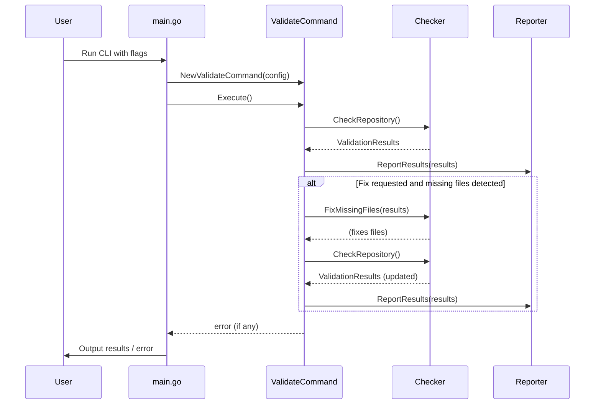

# Repository Validation Script

A script for validating the presence of common project files in a repository.
It can be used to ensure that all required files are present and to generate missing files if desired.

## Usage

```bash
# Build the tool
go build -o repo-validate

# Basic validation (current directory)
./repo-validate

# Validate a specific repository
./repo-validate --path /path/to/repository

# Generate missing files
./repo-validate --fix

# Only report issues without making changes
./repo-validate --dry-run

# Output results in JSON format
./repo-validate --json

# Show help
./repo-validate --help
```

### Options

**Basic Options:**
- `--path`: Path to the repository to validate (default: current directory)
- `--fix`: Generate missing files based on templates
- `--dry-run`: Only report issues without making changes
- `--json`: Output results in JSON format

**File Group Options:**
- `--all`: Check all optional file groups
- `--augment`: Check Augment AI related files (.augment-guidelines, .augmentignore)
- `--docker`: Check Docker related files (Dockerfile, docker-compose.yaml, .dockerignore)
- `--typescript`: Check TypeScript/JavaScript related files (package.json, tsconfig.json)
- `--devcontainer`: Check DevContainer related files (.devcontainer.json)
- `--devenv`: Check DevEnv related files (devenv.nix)

By default, only the core files (README.md, LICENSE.md, .gitignore, SECURITY.md) are checked. Use the file group options to check additional files.

**Example Usage:**

```bash
# Check a TypeScript project with Docker support
./repo-validate --typescript --docker

# Check all possible files in a repository
./repo-validate --all

# Generate missing files for a TypeScript project
./repo-validate --typescript --fix
```

### Exit Codes

- `0`: Success - all must-have files are present
- `1`: Error - some must-have files are missing or an error occurred

### Example Output

```
INFO Repository Validation Results
INFO ===========================
ERROR ✗ Some must-have files are missing status=failed
ERROR Missing must-have files:
ERROR   - README.md
ERROR   - .gitignore
ERROR   - LICENSE.md
ERROR   - SECURITY.md
WARN Missing should-have files:
WARN   - AUTHORS
WARN   - MAINTAINERS.md
WARN   - .editorconfig
WARN   - .augment-guidelines
WARN   - .augmentignore
WARN   - CONTRIBUTING.md
WARN   - CODE-OF-CONDUCT.md
WARN   - CODEOWNERS
INFO Run with --fix to generate missing files
```

#### JSON Output Example

```json
{
  "success": false,
  "missingMustHaveFiles": [
    "README.md",
    ".gitignore",
    "LICENSE.md",
    "SECURITY.md"
  ],
  "missingShouldHaveFiles": [
    "AUTHORS",
    "MAINTAINERS.md",
    ".editorconfig",
    ".augment-guidelines",
    ".augmentignore",
    "CONTRIBUTING.md",
    "CODE-OF-CONDUCT.md",
    "CODEOWNERS"
  ]
}
```

## Architecture

